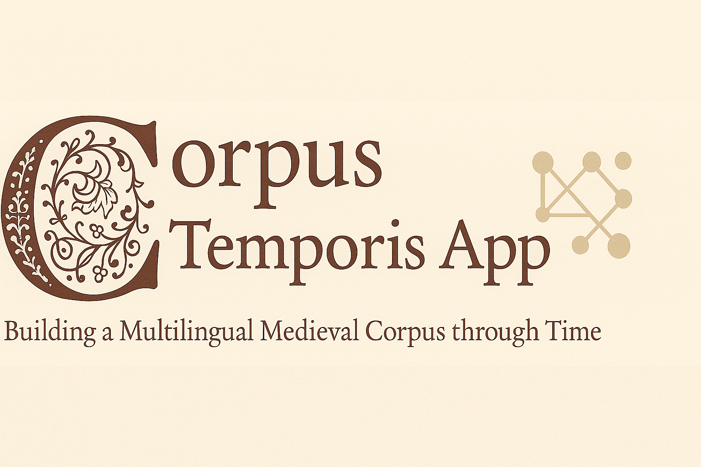

<p align="center">
  
</p>


[](https://creativecommons.org/licenses/by-nc-sa/4.0/)
[](https://github.com/carolisteia/CorpusTemporis/issues)
[](https://github.com/carolisteia/CorpusTemporis/releases)

# 📜 Corpus Temporis

> *An app for multilingual medieval corpora across time.*  
> *Building temporal bridges through medieval texts.*


## Overview

This repository contains the code for a **web-based application form** created for building and structuring the [Multilingual Segmentation Dataset](https://github.com/ProMeText/Aquilign/tree/main/data/multiling_data) of the [AQUILIGN — Multilingual Aligner and Collator](https://github.com/ProMeText/Aquilign) project.

The application was built using [Streamlit](https://streamlit.io/) to facilitate the structured collection, organization, and storage of textual data for historical and linguistic research.

---

## 🎯 Purpose

The primary goal of this application is to **streamline the collection process** of historical multilingual texts by allowing users to insert, organize, and store textual data in a structured format.

This tool ensures that all textual sources are **well-documented, traceable, and accessible** for further analysis. It provides an interface for submitting texts, viewing statistical insights, and managing stored records.

📌 **Links:**
- [Application Form]() (Currently private)
- [Compiled Data CSV](https://github.com/carolisteia/mulada/blob/main/data.csv)

### Why This Corpus?

This dataset is intended for **training machine learning models for text segmentation**—a key task in breaking down texts into meaningful linguistic units. This work is crucial for improving **text accessibility and analysis, particularly for historical documents.**

The corpus primarily consists of **prose texts from the 13th to 15th centuries**, with the possibility of extending into the mid-16th century. Texts have been selected based on **thematic diversity** to create a **rich dataset** for model training and research purposes.

---

## 📌 Features: Medieval Multilingual Corpus App

The application consists of **four main pages**:

1. **App** – The main form for text submission.
2. **Display TXT** – View and convert XML files to plain text.
3. **Stats** – Visualize statistical insights about the uploaded texts.
4. **Texts** – Manage and search all submitted texts.

### 🔹 **1. App (Submission Form)**

This page allows users to input **detailed metadata** about each text, including:
- **Source information**
- **File uploads** (TXT and/or XML)
- **Mandatory fields** (marked with `*`)

🚨 **Note:** Certain fields are required before submission to ensure completeness.

### 🔹 **2. Display TXT**

- View and **convert XML files** into plain text format for easier readability and processing.

### 🔹 **3. Stats (Text Statistics)**

- Provides **automatically generated statistics** based on the submitted corpus.
- Helps analyze trends, distribution, and text characteristics.

### 🔹 **4. Texts (Corpus Management)**

- View all submitted texts in a **searchable format**.
- **Download texts as CSV** for external use.
- **Modify or delete entries** as needed.

---
## 🚀 Getting Started

1. **Clone the Repository**
   ```bash
   git clone https://github.com/carolisteia/mulada.git
   cd mulada

2. **Install dependencies**  
   ```bash
   pip install -r requirements.txt

3. **Run the Streamlit App**
   ```bash
    streamlit run app.py

4. **Access the Application** Open your browser and navigate to http://localhost:8501


---

## 🤝 Contributing

Contributions are welcome! Please fork this repository and submit a pull request for any enhancements or bug fixes.
Open an issue to suggest improvements or ask questions.


---

## 🔗 Related Projects

This repository is part of a broader ecosystem of tools and corpora developed for the study of medieval multilingual textual traditions:

- **[Aquilign](https://github.com/your-org/aquilign)**  
  A clause-level multilingual alignment engine based on contextual embeddings (LaBSE), designed specifically for premodern texts.

- **[Multilingual Segmentation Dataset](https://github.com/your-org/multilingual-segmentation-dataset)**  
  Source texts and segmented versions in multiple medieval Romance languages, as well as Latin and English, used for training and evaluating clause segmentation models.


## 🗂️ Project Structure
 ```bash
    mulada/
    ├── backup/             # Backup files
    ├── data/               # Data files
    ├── pages/              # Streamlit pages
    ├── txts/               # Text files
    ├── utils/              # Utility scripts
    ├── xmls/               # XML files
    ├── .gitignore          # Git ignore file
    ├── app.py              # Main application script
    ├── data.csv            # Compiled data CSV
    ├── options.py          # Options configuration
    ├── requirements.txt    # Python dependencies
    └── xmls.py             # XML processing script
```
---

## 📜 Licensing

The texts within this corpus are released under the **[CC BY-NC-SA](https://creativecommons.org/licenses/by-nc-sa/4.0/)** license. This allows:
✅ Adaptation, remixing, and further development  
✅ Non-commercial use  
✅ Proper attribution to original authors  
✅ Sharing under the same licensing terms  

For full details and source citations, refer to the **"sources"** and **"corpus"** columns in the [compiled data CSV](https://github.com/carolisteia/mulada/blob/main/data.csv).

