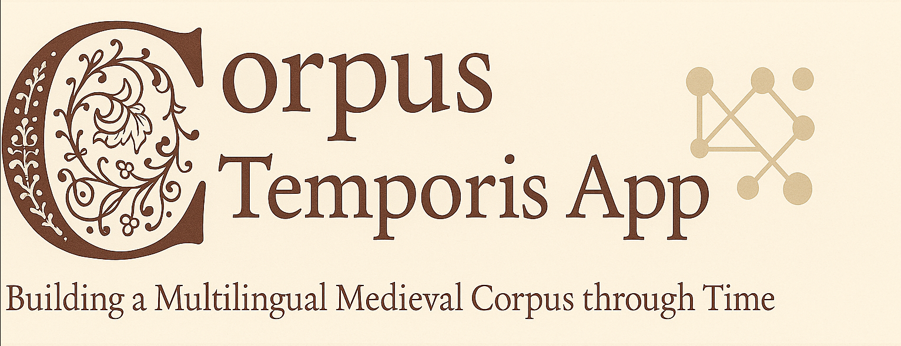

<p align="center">
  
</p>


[](https://creativecommons.org/licenses/by-nc-sa/4.0/)
[](https://github.com/ProMeText/CorpusTemporis/issues)
[](https://github.com/ProMeText/CorpusTemporis/releases)
[](https://doi.org/10.5281/zenodo.16992629)


# 📜 Corpus Temporis

> *An app for multilingual medieval corpora across time.*  
> *Building temporal bridges through medieval texts.*


## Overview

This repository contains the code for a **web-based application form** created for building and structuring the [Multilingual Segmentation Dataset](https://github.com/ProMeText/Aquilign/tree/main/data/multiling_data) of the [AQUILIGN — Multilingual Aligner and Collator](https://github.com/ProMeText/Aquilign) project.

The application was built using [Streamlit](https://streamlit.io/) to facilitate the structured collection, organization, and storage of textual data for historical and linguistic research.

---

## 🎯 Purpose

The primary goal of this application is to **streamline the collection process** of historical multilingual texts by allowing users to insert, organize, and store textual data in a structured format.

This tool ensures that all textual sources are **well-documented, traceable, and accessible** for further analysis. It provides an interface for submitting texts, viewing statistical insights, and managing stored records.

📌 **Dataset Access**:  
- [Metadata CSV (`data.csv`)](./data.csv) — structured metadata about the texts  
- [Multilingual Segmentation Dataset](https://github.com/ProMeText/multilingual-segmentation-dataset/tree/main/data) — raw and segmented texts


### Why This Corpus?

This dataset is intended for **training machine learning models for text segmentation**—a key task in breaking down texts into meaningful linguistic units. This work is crucial for improving **text accessibility and analysis, particularly for historical documents.**

The corpus primarily consists of **prose texts from the 13th to 15th centuries**, with the possibility of extending into the mid-16th century. Texts have been selected based on **thematic diversity** to create a **rich dataset** for model training and research purposes. For further information see the related repo [Multilingual segmentation Dataset](https://github.com/ProMeText/multilingual-segmentation-dataset).

---

## 📌 Features: Corpus Temporis App

| Page          | Icon | Description |
|---------------|------|-------------|
| **App**       | 📝   | Main form for text submission. Input metadata, upload TXT/XML, fill required fields (`*`). |
| **Display TXT** | 📄 | View XML files and convert them into plain text for easier readability. |
| **Stats**     | 📊   | Automatic statistics on the submitted corpus. Analyze trends, distributions, and features. |
| **Texts**     | 📚   | Manage the corpus: search entries, download as CSV, edit or delete texts. |

>Further documentation is available in [**docs/features.md**](./docs/features.md).
---

## 🚀 Getting Started

1. **Clone the Repository**
   ```bash
   git clone https://github.com/ProMeText/CorpusTemporis.git
   cd CorpusTemporis

2. **Install dependencies**  
   ```bash
   pip install -r requirements.txt

3. **Run the Streamlit App**
   ```bash
    streamlit run app.py

4. **Access the Application** 
    - Once you run the command, Streamlit will usually **open a new tab in your default browser automatically**.  
    If it doesn’t, you can manually navigate to [http://localhost:8501](http://localhost:8501).
---

## 🤝 Contributing & Collaborative Workflow

The **Corpus Temporis App** is collaboratively maintained by the **ProMeText team**.  

- The application manages **metadata** describing the texts, available in: [data.csv](./data.csv)  
- The **raw and segmented texts** are stored in the companion repository: [Multilingual Segmentation Dataset](https://github.com/ProMeText/multilingual-segmentation-dataset/data)  

📂 Always access the latest compiled metadata here → [data.csv](./data.csv)

---

Contributions are welcome — but the workflow depends on whether you are a **ProMeText member** or an **external contributor**:

---

### 👥 Access Policy

| Role | Permissions |
|------|-------------|
| **ProMeText team** | 🔑 Direct write/admin access — can push changes without restriction |
| **External contributors** | 📝 Can open issues or pull requests, but cannot modify `data.csv` directly |

---

### 📝 External Contributors — How to Propose New Data
1. Open a **GitHub Issue** (use label `contribution` when possible).  
2. Clearly describe the data (text, metadata, segmentation, etc.).  
3. Optionally fork the repo and create a **Pull Request**.  
   - ❌ Do **not** edit `data.csv` directly.  
   - ✅ Add your data in a separate file (e.g., `data_new.csv`) or attach it to the issue/PR.  
4. The ProMeText team will review and integrate your contribution.

---

### 🛠️ ProMeText Team Members — Local Workflow
1. Pull the latest changes:
 ```bash
    git pull origin main
 ```  
2. Run the application locally:
 ```bash
    streamlit run app.py
   ```
3. After making changes, commit and push:
  ```bash
    git add data.csv
    git commit -m "Update dataset: [short description]"
    git push origin main
   ```
4. If conflicts occur in `data.csv`, resolve them manually before pushing.
---

## 🔗 Related Projects

This repository is part of a broader ecosystem of tools and corpora developed for the study of medieval multilingual textual traditions:

- **[Aquilign](https://github.com/your-org/aquilign)**  
  A clause-level multilingual alignment engine based on contextual embeddings (LaBSE), designed specifically for premodern texts.

- **[Multilingual Segmentation Dataset](https://github.com/your-org/multilingual-segmentation-dataset)**  
  Source texts and segmented versions in multiple medieval Romance languages, as well as Latin and English, used for training and evaluating clause segmentation models.


## 🗂️ Project Structure
 ```bash
    CorpusTemporis/
    ├── backup/             # Backup files
    ├── data/               # Data files
    ├── pages/              # Streamlit pages
    ├── txts/               # Text files
    ├── utils/              # Utility scripts
    ├── xmls/               # XML files
    ├── .gitignore          # Git ignore file
    ├── app.py              # Main application script
    ├── data.csv            # Compiled data CSV
    ├── options.py          # Options configuration
    ├── requirements.txt    # Python dependencies
    └── xmls.py             # XML processing script
```
---

## 📜 Licensing

The texts within this corpus are released under the **[CC BY-NC-SA](https://creativecommons.org/licenses/by-nc-sa/4.0/)** license. This allows:
✅ Adaptation, remixing, and further development  
✅ Non-commercial use  
✅ Proper attribution to original authors  
✅ Sharing under the same licensing terms  

For full details and source citations, refer to the **"sources"** and **"corpus"** columns in the [compiled data CSV](https://github.com/carolisteia/mulada/blob/main/data.csv).

---
# 💰 Funding

This work benefited from national funding managed by the **Agence Nationale de la Recherche** under the *Investissements d'avenir* programme with the reference **ANR-21-ESRE-0005 (Biblissima+)**.

> Ce travail a bénéficié d'une aide de l’État gérée par l’**Agence Nationale de la Recherche** au titre du programme d’**Investissements d’avenir** portant la référence **ANR-21-ESRE-0005 (Biblissima+)**.


<p align="center">
  
</p>


